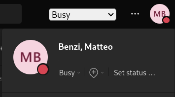
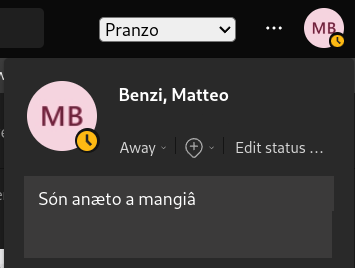

# Fuk u teams 1.0
Tampermonkey script to force and keep an availability status in ms Teams (web version only)





Teams use some Windows api to know if you are AFK or not (like see if the mouse is moving), but in the browser version this (_luckily_) doesn't work. So teams ends up show an "away" status even if you are working hard, and maybe some colleagues decide to not contact you just because you "appear away" (which may sound like a feature but just focus on the fact that Teams lies to the others).

This script try to fix this problem letting you set the status and avoid automatic changes made by Teams.

## Features
- Force and keep the Teams availability status
- Associate a custom note to a custom status
- Support for the pinned notes (i.e. every one will see it if they try to message you)

## Customization
To customize the statuses you have to modify this map inside the code:
```js
const statusMap = {
    "Script Off": {"availability":"", "note": ""},
    "Available": {"availability":"Available", "note": ""},
    "Busy": {"availability":"Busy", "note": ""},
    "DoNotDisturb": {"availability":"DoNotDisturb", "note": ""},
    "BeRightBack": {"availability":"BeRightBack", "note": ""},
    "Away": {"availability":"Away", "note": ""},
    "Offline": {"availability":"Offline", "note": ""}
};
```
By default it contains all the Teams's statuses, but you can add other by simply specifying the `"availability"` and a `"note"`.

To show you an example, in my daily work I added those two custom status with some notes:
```js
const statusMap = {
     // ...
    "Pausetta": {"availability":"BeRightBack", "note": "Pausetta caffè"},
    "Pranzo": {"availability":"Away", "note": pinned("Són anæto a mangiâ")}
};
```

## Installation
- Install [Tampermonkey](https://www.tampermonkey.net/) in your browser
- Copy the script [fuk_u_teams.js](fuk_u_teams.js) in tampermonkey
- Open Teams from the browser

## Original author
The original script was "stolen" from [this reddit post](https://www.reddit.com/r/MicrosoftTeams/comments/k5w349/script_for_keeping_available_status_perpetually/).
Later, I add some feature starting from that snippet.
